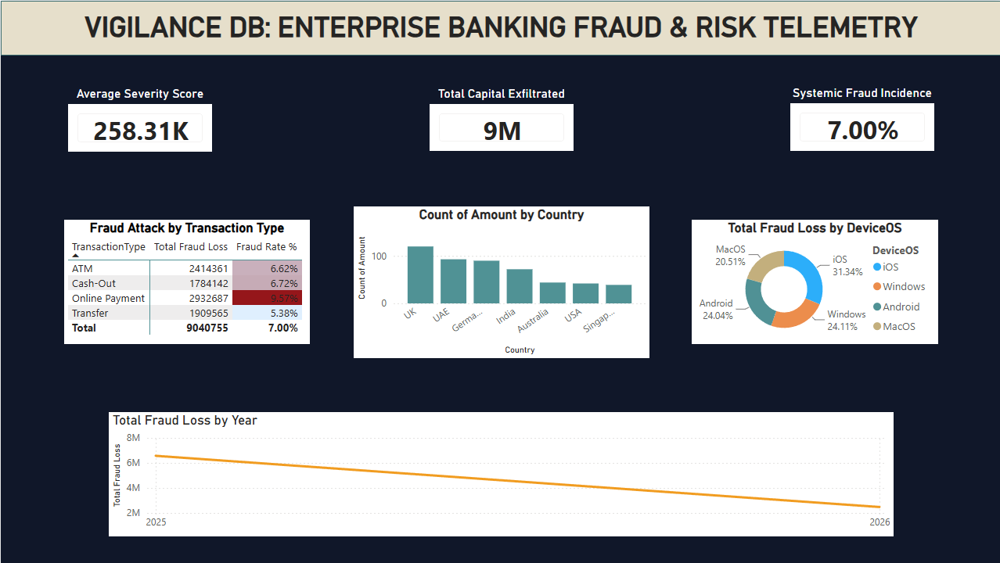
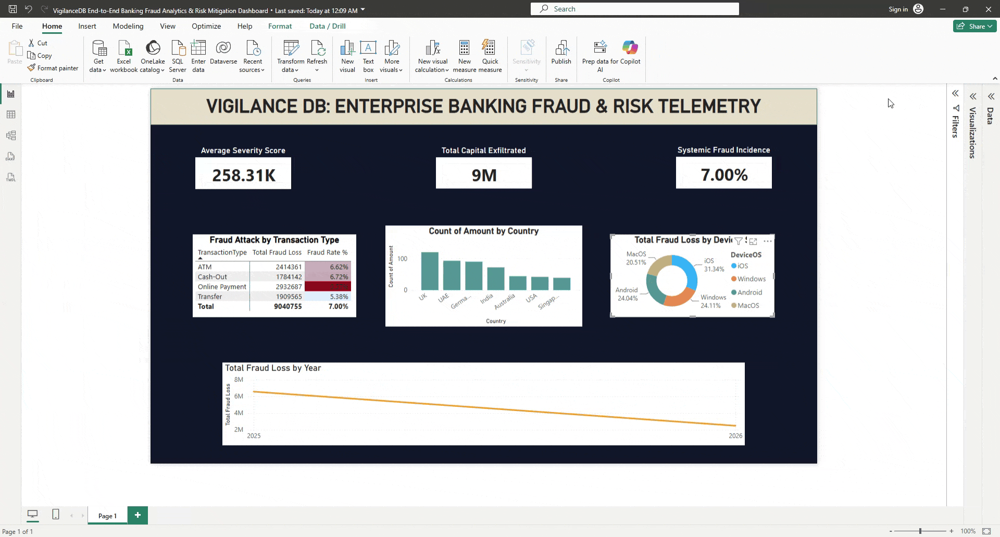

# VigilanceDB: End-to-End Banking Fraud Analytics & Risk Mitigation Dashboard

## 🏦 Business Case and Threat Environment
Modern retail banking networks face sophisticated, automated fraud vectors that compromise consumer accounts and drain operational capital. This analytics project establishes an interactive, unified tracking hub for financial crime compliance teams and risk officers.

By centralizing telemetry across hardware profiles, client transaction types, and risk flags, this dashboard isolates high-velocity attack trends, tracks systemic fraud incidence rates, and prevents balance leakages before they scale out of control.

---

## 🚀 Interactive Control Interface Preview
Below is the dark-themed operational UI built for financial crime units:

---

## 💡 Analytical Problem Solutions Addressed
* **Capital Exfiltration Controls:** Isolates exact monetary losses attributed to active threats vs. routine account volumes.
* **Vector Profile Isolation:** Cross-references device operating systems with historic transaction types to pinpoint platform vulnerabilities (e.g., elevated Android emulator attack patterns).
* **Dynamic Stratification Slicing:** Empowers analytical users to instantly filter the entire pipeline down to "High Risk" consumer categories.

---

## 🛠️ Data Modeling Infrastructure (Star Schema)
The underlying architecture enforces clear relational boundaries to maintain optimal query performance:
* **Fact Table:** `Fact_Transactions` (Houses transactional amounts, timestamps, and binary ground-truth fraud identifiers).
* **Dimension Tables:** `Dim_Customers` (Client demographics and behavioral risk banding) and `Dim_Devices` (Hardware classification indices).

### DAX Engineering Highlights:
The analytical layer uses optimized Data Analysis Expressions (DAX) to query threat attributes:
* **Targeted Loss Aggregation:**
  Total Fraud Loss = SUMX(Fact_Transactions}, Fact_Transactions[Amount] * Fact_Transactions[IsFraud])
* **Fields Incident Performance:**
  Fraud Rate % = DIVIDE(CALCULATE(COUNT(Fact_Transactions[TransactionID]), Fact_Transactions[IsFraud] = 1), COUNT(Fact_Transactions[TransactionID]), 0)

---

## ⚙️ Direct Execution Steps
1. Download the file found under `Report/VigilanceDB End-to-End Banking Fraud Analytics & Risk Mitigation Dashboard.pbix`.
2. Launch the file locally via **Power BI Desktop**.
3. Use the contextual slicers at the top of the reporting canvas to toggle between distinct user risk pools to view responsive cross-filtering behavior.
